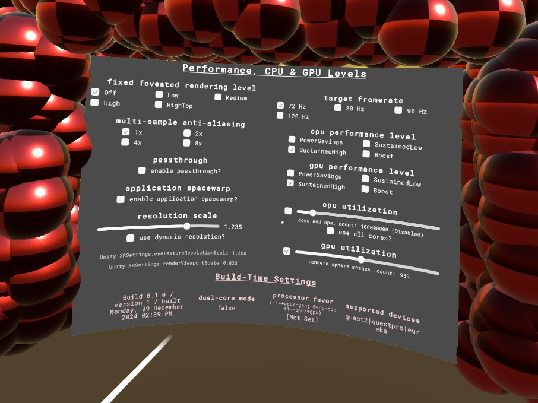

# Unity Performance Settings Sample



The Unity Performance Settings sample showcases methods that Unity developers can use to improve performance in their applications.

It is recommended to use [OVR Metrics Tool](https://developers.meta.com/horizon/documentation/native/android/ts-ovrmetricstool/), or the [Meta Quest Developer Hub Performance Analyzer](https://developer.meta.com/horizon/documentation/native/android/ts-mqdh-logs-metrics/#use-performance-analyzer), in conjunction with this sample to measure the performance effects of these methods.

The majority of PerformanceSettings is licensed under [MIT LICENSE](./LICENSE), however files from [Text Mesh Pro](http://www.unity3d.com/legal/licenses/Unity_Companion_License) are licensed under their respective licensing terms.

## Getting started

First, ensure you have Git LFS installed by running this command:
```sh
git lfs install
```

Then, clone this repo using the "Code" button above, or this command:
```sh
git clone https://github.com/oculus-samples/Unity-PerformanceSettings.git
```

All of the actual project files are in Assets/PerformanceSettings. This folder includes all scripts and assets to run the sample, excluding those that are part of plugins.

This project uses the [Meta XR Platform SDK](https://assetstore.unity.com/packages/tools/integration/meta-xr-platform-sdk-262366), [Meta XR Interaction SDK](https://assetstore.unity.com/packages/tools/integration/meta-xr-interaction-sdk-264559), and [Meta XR Interaction SDK OVR Integration](https://assetstore.unity.com/packages/tools/integration/meta-xr-interaction-sdk-ovr-integration-265014). These are all free packages on the Unity Asset Store. In order to load this sample, you will need to be logged in to a Unity account with licenses for these packages.

To run the sample, open the project folder in *Unity 2021.3.26f1* or newer and load the [Assets/PerformanceSettings/Scenes/MainScene](Assets/PerformanceSettings/Scenes/MainScene.unity) scene.

## Controls

The Unity-PerformanceSettings sample consists of two interactable screens. All interactions can be performed by pointing either controller and pressing the trigger button.

The rightmost screen, labelled __Logs__, is an in-game representation of the Unity Console. In Development builds, this screen will update with debug logs, warning and errors, exactly like the Unity Console window does during play-in-editor sessions.

The main screen, labelled __Performance, CPU & GPU Levels__, provides the following controls:

- Target Framerate. This lists all possible framerates for your headset. Increasing target framerates will increase CPU & GPU utilization, as the CPU & GPU have less time per-frame.
- Fixed Foveated Rendering. Increasing FFR level will decrease GPU utilization, as fewer pixels will be rendered per frame. Note that, because the menus themselves are rendered as [Compositor Layers](https://developer.meta.com/horizon/documentation/unity/os-compositor-layers/) for extra clarity, you will only see the effects of FFR on the environment outside the menus. Rendering high-contrast spheres with the GPU utilization slider will increase the appearance of FFR effects.
- Resolution Scale. Increasing resolution scale will decrease GPU utilization, as fewer pixels will be rendered per frame.
- [Dynamic resolution](https://developer.meta.com/horizon/documentation/unity/dynamic-resolution-unity/) checkbox & min/max dynamic resolution sliders. If dynamic resolution is enabled, the application will reduce resolution scale within the specified threshold in order to preserve framerate. Note that dynamic resolution [must be enabled to access GPU level 5](https://developer.meta.com/horizon/documentation/unity/po-quest-boost/#setting-processorperformancelevel-to-boost) on Quest 2 and Quest Pro devices.
- [CPU and GPU performance levels](https://developer.meta.com/horizon/documentation/unity/os-cpu-gpu-levels/#setting-cpu-and-gpu-levels). These determine the CPU and GPU level range for the application.
- CPU utilization. When the checkbox is enabled, this will perform arbitrary work on the CPU per-frame. Increase the slider to increase the amount of performed work, allowing control of CPU utilization. Arbitrary work is only performed on the main thread, unless "use all cores?" is checked, in which case it is split across all application cores.
- GPU utilization. when the checkbox is enabled, this will render arbitrary amounts of spheres per-frame. Increase the slider to increase the amount of spheres rendered, allowing control of GPU utilization.

Additionally, at the bottom of the main screen, there is a list of __Build-Time Settings__, which cannot be changed in-game. When possible, controls for these settings are exposed in the Unity Editor via the __Meta/Unity Performance__ editor window, located in [Assets/PerformanceSettings/Scripts/Editor/IntroEditorWindow.cs](Assets/PerformanceSettings/Scripts/Editor/IntroEditorWindow.cs).

 - [Dual-core mode](https://developer.meta.com/horizon/documentation/unity/po-quest-boost/#dual-core-mode) status. if enabled, you can perform more CPU utilization operations per-frame if the `use all cores?` checkbox is disabled, but fewer operations per-frame if `use all cores?` is enabled.
 - [Processor favor](https://developers.meta.com/horizon/documentation/unity/po-quest-boost/#trading-between-cpu-and-gpu-levels-meta-quest-3-only) status
 - Supported Devices, the value of [com.oculus.supportedDevices](https://developer.meta.com/horizon/blog/managing-meta-quest-1-guidance-developers/) in the AndroidManifest.xml for the application. Listing a headset type here gives it access to some of the performance controls above.
